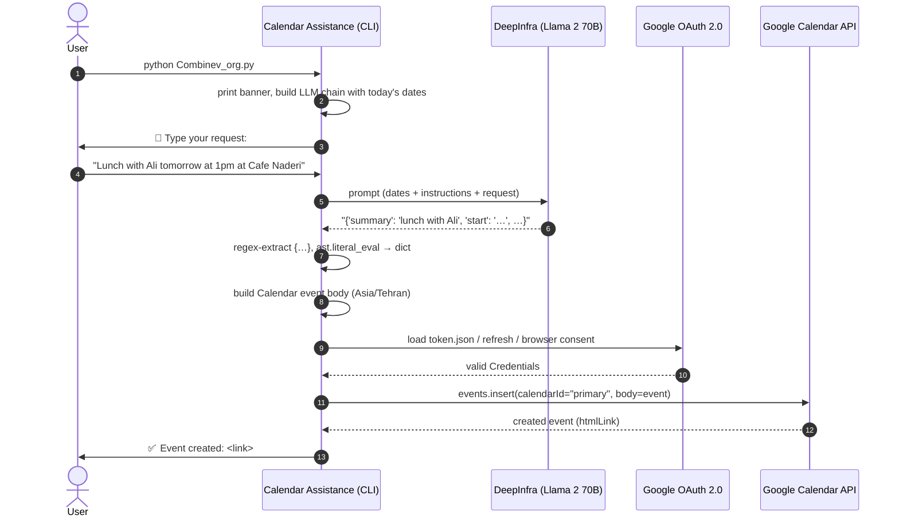

# API Flow — From Typed Request to Google Calendar

This document traces, step by step, exactly what happens from the moment the user types an event request until the event appears in their Google Calendar. All references are to `Combinev_org.py`.

---

## Overview



## Step-by-Step

### Step 0 — Startup

Running `python Combinev_org.py` prints the banner (`print_banner()`) and enters `main()`.

### Step 1 — Chain construction (`create_llm_chain`)

- The DeepInfra API token is placed in the process environment.
- `get_current_dates()` computes **today's Gregorian and Jalali dates**.
- Both dates are interpolated into the extraction prompt so the model can resolve "tomorrow", "next Monday", and Jalali dates *for the current year*.
- A `PromptTemplate` with the single variable `{request}` is wrapped into an `LLMChain`.

### Step 2 — User input (`get_user_request`)

The CLI prompts:

```text
📝 Type your request:
```

The raw string is passed to the chain: `llm_chain({'request': user_req})` — this performs a **remote inference call to DeepInfra**.

### Step 3 — LLM extraction

The model is instructed to reply with **only** a Python dictionary string containing: `summary`, `location`, `description`, `start`, `end`, `attendees` — missing fields marked `"not provided"`, datetimes formatted as `YYYY-MM-DDTHH:MM:SS+00:00`, and a 1-hour end time assumed when only a start is given.

### Step 4 — Response parsing (`get_user_request`, continued)

- The regex `({.*})` (DOTALL) pulls the first `{…}` block out of the response text, tolerating any surrounding prose.
- `ast.literal_eval` converts it into a real Python `dict` (literals only — no code execution).
- **Failure path**: no match → `ValueError("Failed to extract dictionary from LLM response")` → caught by `main()` → `❌ An unexpected error occurred: …`.

### Step 5 — Event body construction (`create_event_dict`)

The parsed fields are mapped to the Google Calendar `events.insert` resource format:

- `summary` and `location` are title-cased.
- `start`/`end` become `{'dateTime': <ISO 8601>, 'timeZone': 'Asia/Tehran'}` objects.

### Step 6 — Authentication (`get_google_credentials`)

| Condition | Action |
|---|---|
| `token.json` exists and is valid | Used as-is (no user interaction) |
| Token expired, refresh token present | Refreshed silently, re-saved |
| No/invalid token | Browser opens; user signs in and grants the calendar scope via `credentials.json`; token saved to `token.json` |

### Step 7 — Event insertion (`create_google_calendar_event`)

- A Calendar API v3 service client is built with the credentials.
- `service.events().insert(calendarId="primary", body=event).execute()` creates the event on the user's **primary calendar**.
- **Success**: the API returns the event resource and the CLI prints `✅ Event created: <htmlLink>` — clicking the link opens the event in Google Calendar.
- **Failure** (`HttpError` — quota, malformed body, permission): printed as `❌ An error occurred: <details>`.

### Step 8 — Completion

`main()` returns and the process exits. The event is now visible in Google Calendar (web/mobile) within seconds.

## HTTP Variant (`main.py`)

When the pipeline is exposed via FastAPI, the flow is identical from Step 1 onward, except the request string arrives as the body of `POST /insert` instead of terminal input, and the result is returned as the HTTP response. *(Note: the wrapper references module variants not included in this repository snapshot — see [CODE_REVIEW.md](CODE_REVIEW.md).)*
