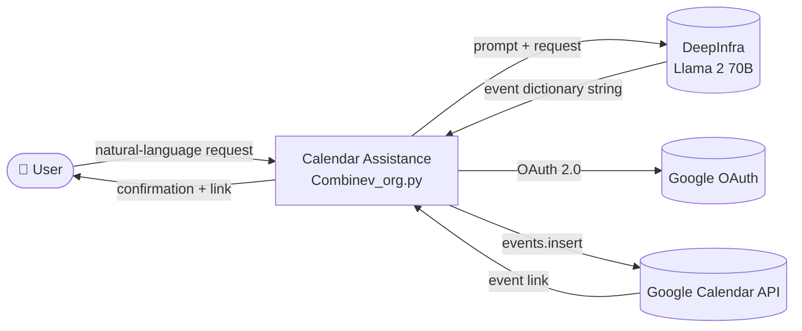
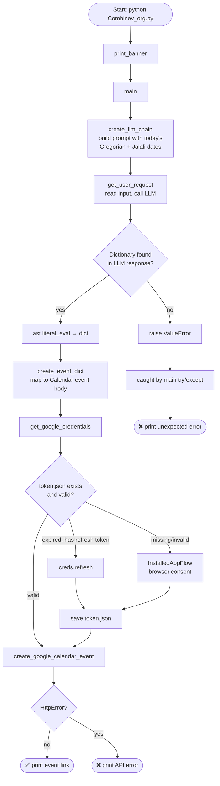
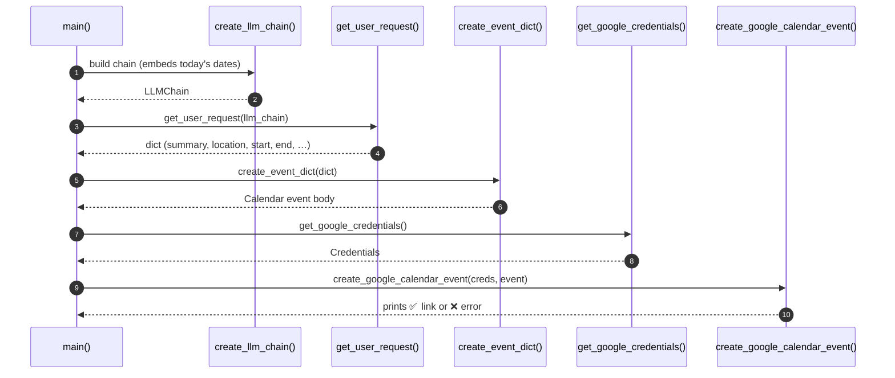
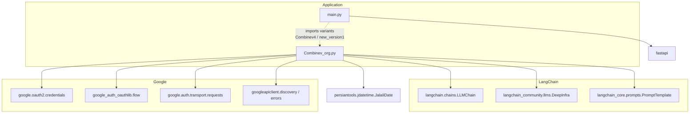
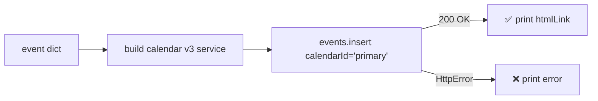
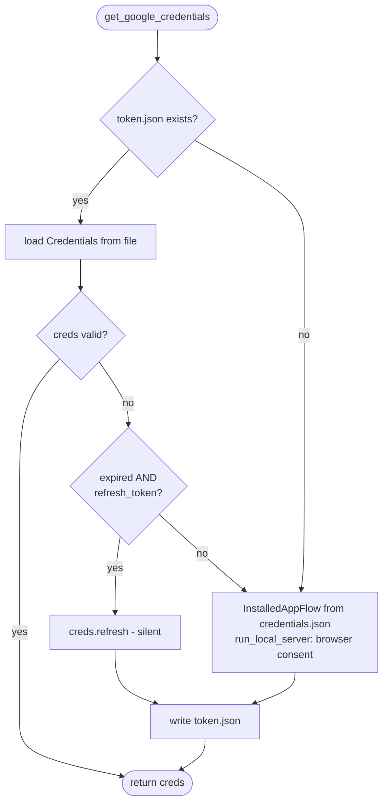

# Technical Documentation — Calendar Assistance

This document describes the internal architecture and design of Calendar Assistance for engineers. For the request lifecycle in narrative form, see [API_FLOW.md](API_FLOW.md).

---

## 1. Overall Architecture

Calendar Assistance is a **single-module pipeline application**. All business logic lives in `Combinev_org.py`; `main.py` is a thin optional HTTP façade. There is no database, no persistent state beyond the cached OAuth token, and no background processing.

The system integrates two external services:

- **DeepInfra** — hosts the LLM (`meta-llama/Llama-2-70b-chat-hf`) that converts natural language into structured event data. Accessed via LangChain.
- **Google Calendar API** — stores the final event. Accessed via the official Google API Python client with OAuth 2.0 credentials.



## 2. Execution Flow



## 3. Folder Structure

The project is intentionally flat:

| Path | Kind | Purpose |
|---|---|---|
| `Combinev_org.py` | module | Entire application pipeline + CLI entry point |
| `main.py` | module | Optional FastAPI HTTP wrapper |
| `requirements.txt` | config | Pinned dependency list |
| `.env.example` | config | Environment variable template |
| `credentials.json` | secret (untracked) | Google OAuth client secrets, user-provided |
| `token.json` | secret (untracked) | Cached/refreshable OAuth user token, auto-generated |
| `*.md`, `LICENSE`, `Makefile`, `.gitignore` | docs/tooling | Documentation and project hygiene |

## 4. Main Modules and File Responsibilities

### `Combinev_org.py` — core application

| Function | Responsibility |
|---|---|
| `print_banner()` | CLI presentation: title/version banner |
| `get_current_dates()` | Returns today's date as `(gregorian, jalali)` strings — the anchor for relative and Jalali date conversion |
| `create_llm_chain()` | Sets the DeepInfra token, instantiates the LLM, builds the extraction prompt (with today's dates baked in), returns an `LLMChain` |
| `get_user_request(llm_chain)` | Reads user input, invokes the chain, regex-extracts the first `{...}` block, parses it with `ast.literal_eval` |
| `create_event_dict(dict_obj)` | Maps the LLM dictionary to the Google Calendar `events.insert` body (title-cases summary/location, fixes time zone to `Asia/Tehran`) |
| `get_google_credentials()` | Full OAuth lifecycle: load cached token → refresh if expired → run browser flow if absent → persist to `token.json` |
| `create_google_calendar_event(creds, event)` | Builds the Calendar service, inserts the event on the `primary` calendar, prints the link or the `HttpError` |
| `main()` | Orchestrates the pipeline inside a top-level `try/except` |

### `main.py` — HTTP façade

Defines a FastAPI app with a single endpoint, `POST /insert`, which passes the raw request body string to the processing module and returns its result.

> ⚠️ It currently imports `Combinev4` and `new_version1`, iteration variants of the core module that are **not present in this repository snapshot** — see [CODE_REVIEW.md](CODE_REVIEW.md).

## 5. Function Call Flow



## 6. Module Dependency Graph



## 7. Google Calendar Integration

- **API**: Google Calendar API v3, via `googleapiclient.discovery.build("calendar", "v3", credentials=creds)`.
- **Operation**: a single `service.events().insert(calendarId="primary", body=event).execute()` call.
- **Scope**: `https://www.googleapis.com/auth/calendar` (full read/write calendar access).
- **Event body** produced by `create_event_dict()`:

```python
{
    'summary':  '<Title-Cased Summary>',
    'location': '<Title-Cased Location>',
    'start': {'dateTime': '<ISO 8601>', 'timeZone': 'Asia/Tehran'},
    'end':   {'dateTime': '<ISO 8601>', 'timeZone': 'Asia/Tehran'},
}
```

- **Error surface**: `googleapiclient.errors.HttpError` is caught locally and printed; all other exceptions bubble to `main()`.



## 8. LLM Interaction Flow

1. `create_llm_chain()` requires the `DEEPINFRA_API_TOKEN` environment variable (read by the LangChain `DeepInfra` wrapper) and exits with a clear message if it is unset.
2. A `PromptTemplate` is built **per run** with today's Gregorian and Jalali dates interpolated via an f-string; `{request}` remains the only template variable.
3. The prompt instructs the model to output *only* a Python-dictionary string with fields: summary, location, description, start, end, attendees — with missing fields marked `"not provided"`, dates in `YYYY-MM-DDTHH:MM:SS+00:00`, and Jalali→Gregorian conversion anchored to the current year.
4. `llm_chain({'request': user_req})` executes the remote inference on DeepInfra.
5. The response text is scanned with the regex `({.*})` (DOTALL) and the match is parsed with `ast.literal_eval` — safer than `eval` since it only accepts Python literals.

## 9. Authentication Flow



- **First run**: browser consent → user grants calendar scope → token persisted.
- **Subsequent runs**: token loaded from disk; refreshed transparently when expired.
- **Secrets on disk**: `credentials.json` (OAuth client) and `token.json` (user token) — both git-ignored.

## 10. Data Flow

| Stage | Format | Example |
|---|---|---|
| User input | free-form string | `"Lunch tomorrow at 1pm at Cafe Naderi"` |
| LLM response | text containing a dict literal | `"{'summary': 'Lunch', 'start': '2026-07-15T13:00:00+00:00', …}"` |
| Parsed | `dict` (via `ast.literal_eval`) | `{'summary': 'Lunch', …}` |
| Event body | Calendar API resource `dict` | `{'summary': 'Lunch', 'start': {'dateTime': …, 'timeZone': 'Asia/Tehran'}, …}` |
| API result | Calendar event resource | contains `htmlLink` shown to the user |

## 11. Exception Handling

Three layers:

1. **`get_user_request`** raises `ValueError` when no dictionary can be located in the LLM output.
2. **`create_google_calendar_event`** catches `HttpError` locally (API-level failures: quota, invalid body, permissions) and prints it.
3. **`main()`** wraps the entire pipeline in `try/except Exception`, converting any failure (parsing, auth, network, missing keys) into a single user-facing error message — the process never crashes with a traceback.

## 12. Technologies & External Libraries

| Technology | Role | Why chosen |
|---|---|---|
| Python 3 | Implementation language | Ecosystem for both LangChain and Google clients |
| LangChain (`langchain`, `-core`, `-community`) | LLM orchestration | Uniform prompt/chain abstraction; `DeepInfra` connector ships in `langchain-community` |
| DeepInfra + Llama 2 70B | NL → structured extraction | Hosted open-weight model; no local GPU needed |
| persiantools | Jalali calendar | Provides today's Jalali date so the LLM can anchor Persian date conversion |
| google-api-python-client | Calendar API v3 | Official, discovery-based client |
| google-auth / google-auth-oauthlib | OAuth 2.0 | Standard installed-app flow with token refresh |
| FastAPI (+ uvicorn) | Optional HTTP layer | Minimal async wrapper around the same pipeline |

## 13. Design Decisions

- **Single-file pipeline** — the problem is a linear five-step flow; splitting it across packages would add indirection without benefit at this size.
- **Prompt built per run** — embedding *today's* dates in the prompt makes relative/Jalali date resolution deterministic with respect to the run date.
- **`ast.literal_eval` over `eval`/`json.loads`** — the model is asked for a *Python* dict string (may use single quotes, which JSON rejects); `literal_eval` parses it without executing arbitrary code.
- **Regex extraction before parsing** — tolerates models that wrap the dictionary in extra prose despite instructions.
- **Fixed `Asia/Tehran` time zone** — matches the primary (Persian-speaking) audience; the LLM is told not to alter times, and the time zone is applied at the Calendar layer.
- **Token caching in `token.json`** — standard Google installed-app pattern; users authenticate in a browser once, not on every run.
- **Graceful top-level error handling** — the tool is user-facing; any failure ends with a readable message rather than a stack trace.
