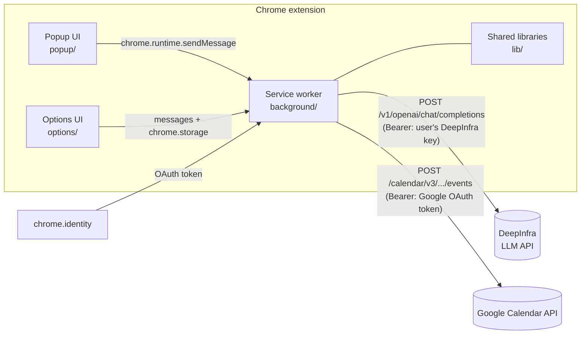

# Technical Guide

## 1. Architecture overview

Calendar Assistant is a serverless Manifest V3 Chrome extension. The browser talks directly to two external APIs; there is no backend to deploy or maintain.



Design rules:

- **All network I/O lives in the service worker.** UI pages never call external APIs; they exchange typed messages with the worker. An in-flight "create event" therefore survives the popup closing.
- **Pure logic is separated from Chrome APIs.** Date conversion, prompt construction, response parsing, and validation (`lib/jalali.js`, most of `lib/llm.js`) import nothing Chrome-specific, so they run under Node's test runner.
- **The AI proposes, the user disposes.** Model output is only ever rendered into an editable preview; nothing reaches Google Calendar without explicit user confirmation.

## 2. Folder structure

```
Calender_assistance/
├── extension/                  # the unpacked extension (ship this)
│   ├── manifest.json           # MV3 manifest, permissions, OAuth client ID
│   ├── background/
│   │   └── service-worker.js   # message router; owns all network calls
│   ├── popup/                  # main UI: request → preview → created
│   │   ├── popup.html / .css / .js
│   ├── options/                # settings UI: API key, model, defaults
│   │   ├── options.html / .css / .js
│   ├── lib/
│   │   ├── jalali.js           # Jalali ↔ Gregorian conversion (pure)
│   │   ├── llm.js              # prompt build, DeepInfra call, parse+validate
│   │   ├── calendar.js         # Google auth + Calendar REST calls
│   │   ├── config.js           # chrome.storage.local schema & access
│   │   ├── errors.js           # AppError with machine-readable codes
│   │   └── logger.js           # namespaced logger, debug-gated
│   └── icons/                  # generated PNGs (16/48/128)
├── docs/                       # this guide + deployment guide
├── tests/
│   ├── jalali.test.mjs         # known dates, leap years, 10-year round-trip
│   ├── llm.test.mjs            # parsing, validation, stubbed API pipeline
│   └── smoke.extension.mjs     # loads the extension in real Chromium
├── scripts/
│   ├── generate_icons.py       # dependency-free PNG icon generator
│   └── package.sh              # builds dist/*.zip for distribution
└── package.json                # test/package scripts; no runtime deps
```

## 3. Technology stack

| Layer | Choice | Rationale |
|---|---|---|
| Extension platform | Manifest V3, module service worker | Current Chrome requirement; MV2 is deprecated |
| Language | Vanilla ES modules (no framework, no bundler) | Zero build step, no supply-chain surface, trivially auditable; the UI is two small pages |
| LLM API | DeepInfra OpenAI-compatible `chat/completions` | Same endpoint shape as OpenAI; model is a config value (default `meta-llama/Llama-3.3-70B-Instruct`) |
| Calendar API | Google Calendar REST v3 via `fetch` | Official API; no client library needed for one endpoint |
| Google auth | `chrome.identity.getAuthToken` | Chrome-native OAuth; tokens cached and refreshed by the browser |
| Jalali dates | Algorithm from jalaali-js (MIT), vendored | ~150 dependency-free lines; unit-tested against known dates |
| Tests | `node:test` + playwright-core smoke test | Stdlib runner for logic; real Chromium load test for the manifest/UI |

## 4. Module responsibilities

### `background/service-worker.js`
Registers a `chrome.runtime.onMessage` router. Message contract:

| `type` | Payload | Returns |
|---|---|---|
| `GET_STATUS` | — | `{ hasApiKey, model, timeZone, calendarId }` |
| `PARSE_REQUEST` | `{ text }` | `{ event, timeZone }` (normalized event) |
| `CREATE_EVENT` | `{ event }` | `{ id, htmlLink }` |
| `TEST_API_KEY` | `{ apiKey?, model? }` | `{ valid: true }` |
| `TEST_GOOGLE_AUTH` | — | `{ calendarSummary }` |

Every response is `{ ok: true, data }` or `{ ok: false, error, code }`. The worker also opens the options page on first install (`onInstalled`).

### `lib/llm.js`
- `buildDateContext(timeZone)` — today's Gregorian *and* Jalali date, weekday, and time, computed in the target time zone via `Intl.DateTimeFormat.formatToParts`. This context is what lets the model resolve "tomorrow"/"فردا" and Jalali dates whose Gregorian equivalent shifts year to year.
- `buildMessages(request, ctx, duration)` — system prompt demanding a single strict-JSON object (schema documented in the prompt) with **wall-clock local datetimes and no UTC offset**.
- `extractEventJson(text)` — balanced-brace scanner tolerant of markdown fences and prose around the JSON.
- `normalizeEvent(raw, opts)` — validation gate: requires summary and parseable start; strips any offset the model added; applies the default duration when `end` is missing or not after `start`; filters attendees to valid emails; maps `"not provided"`-style strings to `null`.
- `parseRequest(...)` / `testApiKey(...)` — the network calls, with `AbortController` timeouts and HTTP-status → `AppError` code mapping. Both accept a `fetch` implementation for testing.

### `lib/calendar.js`
- `getAuthToken(interactive)` — promisified `chrome.identity.getAuthToken`, handling both the legacy string and the newer `{ token }` return shape.
- `buildEventResource(event, timeZone)` — converts the normalized event into a Calendar API resource. Times are sent as offset-less `dateTime` plus an explicit `timeZone` field (the Calendar API accepts this pairing), which avoids the classic bug of an offset and a time zone disagreeing.
- `insertEvent(resource, calendarId)` / `testGoogleAuth(calendarId)` — REST calls with a one-shot retry: on HTTP 401 the cached token is dropped (`removeCachedAuthToken`) and re-acquired.

### `lib/config.js`
Single source of truth for settings (`DEFAULTS`), persisted in `chrome.storage.local`:
`deepinfraApiKey`, `model`, `timeZone` (empty = auto-detect), `defaultDurationMinutes`, `calendarId`, `debugLogging`.

### `popup/` and `options/`
Thin controllers: read inputs, send messages, render results. The popup is a three-step flow (*describe → review/edit → created*), surfaces errors in a dedicated alert region, and deep-links to options when the error code is `NO_API_KEY`/`INVALID_API_KEY`. Inputs use `dir="auto"` so Persian text renders RTL naturally.

## 5. Authentication and token management

**DeepInfra key (user secret)**
- Entered in options, kept in `chrome.storage.local`. It never appears in the repository, in code, or in any request except `Authorization: Bearer` headers to `api.deepinfra.com`.
- `storage.local` is the standard placement for user-supplied keys in extensions; it is per-profile and not synced. Anyone with OS-level access to the profile could read it — acceptable for a personal pay-per-use key, and the options page says exactly where the key lives.

**Google OAuth (managed by Chrome)**
- The manifest's `oauth2` section declares the client ID and the single scope `https://www.googleapis.com/auth/calendar.events` (create/edit events only — deliberately narrower than full `auth/calendar`).
- `chrome.identity.getAuthToken` performs the flow, caches the access token, and refreshes it. The extension holds tokens only transiently in memory; a 401 triggers cache invalidation and one retry.
- The OAuth **client ID is not a secret**; binding is enforced by Google against the extension ID, which is why deployment requires a client bound to *your* extension ID (see the Deployment Guide).

## 6. Data flow (happy path)

1. Popup sends `PARSE_REQUEST { text }`.
2. Worker loads config, resolves the time zone, builds the date context and prompt, calls DeepInfra (`temperature: 0`).
3. The response is fence-stripped, JSON-extracted, and normalized. Failures at any point raise a coded `AppError`.
4. Popup renders the event into editable fields; the user adjusts and confirms.
5. Popup sends `CREATE_EVENT { event }` (the *edited* values, re-validated in the popup).
6. Worker builds the Calendar resource, obtains a Google token, `POST`s the event, and returns `{ htmlLink }`, which the popup shows as "Open in Google Calendar".

What leaves the machine: the request text and date context go to DeepInfra; the confirmed event fields go to Google. Nothing else, nowhere else.

## 7. Configuration options

| Option | Default | Notes |
|---|---|---|
| DeepInfra API key | — (required) | Tested via a one-token completion |
| Model | `meta-llama/Llama-3.3-70B-Instruct` | Any DeepInfra chat model ID; 70B-class models handle Jalali conversion best |
| Calendar ID | `primary` | Any calendar the account can write to |
| Default duration | 60 min | Applied when the request has no end time (5–1440, validated) |
| Time zone | auto-detect | IANA name; validated with `Intl.DateTimeFormat` before saving |
| Debug logging | off | Verbose logs in the service-worker console |

## 8. Error handling strategy

- All failures are thrown as `AppError(code, message)` (`lib/errors.js`); the worker serializes them, and UIs render the message while reacting to the code (`NO_API_KEY` / `INVALID_API_KEY` show an "Open settings" button).
- Codes: `NO_API_KEY`, `INVALID_API_KEY`, `RATE_LIMITED`, `LLM_UNAVAILABLE`, `LLM_BAD_OUTPUT`, `VALIDATION`, `AUTH_FAILED`, `CALENDAR_ERROR`, `NETWORK`, `UNKNOWN`.
- Defensive layers around the LLM: strict-JSON prompt → tolerant extraction → schema validation → **mandatory human review**. A model hallucination can therefore produce at worst a wrong *preview*.
- Both external calls have timeouts (45 s LLM, 20 s key test) via `AbortController`; Google calls retry once on 401 with a fresh token. HTTP error bodies are truncated into user-readable messages.
- UI actions disable their buttons while in flight to prevent duplicate submissions.

## 9. Logging and debugging

- `lib/logger.js` prefixes output with `[CalendarAssistant:<namespace>]`. Warnings/errors always log; `debug`/`info` only when *Enable debug logging* is on in options.
- Service worker console: `chrome://extensions` → card → *Inspect views: service worker*. Popup/options: right-click → Inspect.
- Debug logs include the parsed event and the exact Calendar resource sent — the two artifacts you need when a date parses oddly.

## 10. Security considerations

- **No secrets in the repository.** The API key is runtime user input; the OAuth client ID is public by design. `.gitignore` additionally blocks `credentials.json`, `token.json`, `.env`, and `*.pem`. (A pre-1.0 prototype in git history exposed a DeepInfra token; it must be considered revoked — see README.)
- **Least privilege**: permissions are `identity` + `storage`; host permissions name exactly the two API origins; the Google scope is `calendar.events`, not full calendar (and not `gmail`, contacts, etc.).
- **No remote code**: MV3's CSP is left at its default; every byte of executed JS ships in the package. No CDNs, no `eval`, no bundled third-party runtime dependencies.
- **Untrusted model output** is treated as data: `JSON.parse` (never `eval`), schema validation, email regex filtering, and DOM insertion via `textContent`/`value` (never `innerHTML` with dynamic content).
- **Prompt injection** is bounded by design: the model can only influence the six event fields, which the user reviews before anything is written.
- **Privacy**: request text goes to DeepInfra under the user's own account/key — users who schedule sensitive events should review DeepInfra's data policy. No analytics, no third-party beacons.

## 11. Extending and maintaining

- **Different LLM provider**: `lib/llm.js` speaks the OpenAI chat-completions dialect — point `DEEPINFRA_CHAT_URL` at any compatible endpoint (OpenAI, Together, a local Ollama with CORS) and add its origin to `host_permissions`. Everything downstream of `extractEventJson` is provider-agnostic.
- **New event fields** (recurrence, reminders, conferencing): extend the JSON schema in `buildMessages`, whitelist the field in `normalizeEvent`, map it in `buildEventResource`, and add an input to the popup preview. Keep the whitelist tight — unknown model keys are dropped by design.
- **More languages**: add the language name and an example to the system prompt; the date-context mechanism already generalizes (add another calendar system alongside the Jalali line if needed).
- **New capabilities** (list events, delete): add a message type in the service worker plus a function in `lib/calendar.js`; widening the OAuth scope will re-prompt users for consent.
- **Maintenance invariants**: keep UI pages free of `fetch`; keep `lib/jalali.js` and the pure parts of `lib/llm.js` Chrome-free (the unit tests enforce this by importing them under Node); run `npm test` and `npm run test:smoke` before packaging; bump the manifest version on every release.
